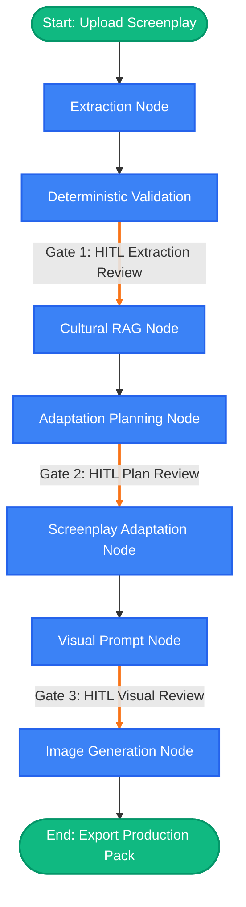

# Cultural Screenplay and Visual Adaptation Studio

A robust, agentic AI platform designed to ingest screenplays and deterministically adapt them into distinct cultural contexts while maintaining narrative continuity.

This MVP fulfills the requirements of the OTT Dialect Platform AI Engineering Hiring Challenge.

## System Overview

The system is built as a highly modular, decoupled application featuring:
1. **Frontend**: A reactive Vue.js SPA providing a 5-stage human-in-the-loop (HITL) review pipeline.
2. **Backend Engine**: A FastAPI server driving a deterministic LangGraph state machine.
3. **Intelligence**: Powered by local `qwen2.5:0.5b` (via Ollama) and a dedicated ChromaDB RAG vector store for cultural rules.
4. **Visuals**: Keyless, dynamic generation powered by the Pollinations AI Stable Diffusion API.

## Core Capabilities

- **Human Approval Gates**: LangGraph natively suspends execution at critical points (Extraction Review, Adaptation Plan Review, Visual Prompt Review) ensuring humans sign off before compute is expended.
- **Strict Cultural Isolation**: Cultural facts are dynamically fetched via ChromaDB embeddings. Thread state isolation prevents memory leakage between disparate adaptations.
- **Dynamic UI Rendering**: No mocked state. The UI dynamically builds its visualization directly from the rich metadata dictionaries injected by the Python orchestration nodes.

## Architecture: The 5-Node Agentic Pipeline

The core architectural triumph of this platform is the `StudioState` LangGraph orchestrator. By modeling the creative pipeline as a strict deterministic state machine, we enforce robust continuity and guarantee human oversight.

### ⭐ Star Points (Pipeline Flow)
1. **Extraction Node**: The LLM processes the source document and extracts Canonical Entities. A deterministic python wrapper standardizes these entities into dictionaries containing `id`, `name`, `aliases`, and `role`. 
2. **Deterministic Validation Node**: Rather than relying on the LLM to hallucinate state transitions, the system utilizes a deterministic `ContinuityValidator` Python class to track object possession across scenes and surface contradictions as warnings.
3. **Cultural RAG Node & Planning**: The system bypasses generic LLM hallucinations by embedding curated cultural handbooks into a local **ChromaDB**. We execute semantic queries against the database to fetch highly specific cultural rules (Wardrobe, Kinship, Architecture) and inject them into the Adaptation Planning prompt.
4. **Adaptation Node**: Using the human-approved Cultural Plan, the LLM rewrites the screenplay snippet.
5. **Visual Prompt Node & Generation**: The LLM generates a visual prompt combining the approved Scene context with Canonical Character rules. The `ImageGenerationService` fires an HTTP POST request to a Stable Diffusion API to generate the asset.

## System Requirements

- Python 3.10+
- Node.js 18+
- Ollama (installed locally with `qwen2.5:0.5b` pulled)

## Setup Instructions

### 1. Backend Setup
```powershell
cd app/backend
python -m venv venv
.\venv\Scripts\activate
pip install -r requirements.txt
```

### 2. Ingest Cultural Knowledge Base (RAG)
```powershell
# Populate the local ChromaDB vector store with the provided cultural dataset
python -m scripts.ingest_knowledge
```

### 3. Run Backend Server
```powershell
uvicorn main:app --reload --host 0.0.0.0 --port 8000
```

### 4. Frontend Setup
Open a new terminal window.
```powershell
cd app/frontend
npm install
npm run dev
```

Navigate to `http://localhost:5173` to experience the Adaptation Studio.

## Pipeline Flow Diagram


